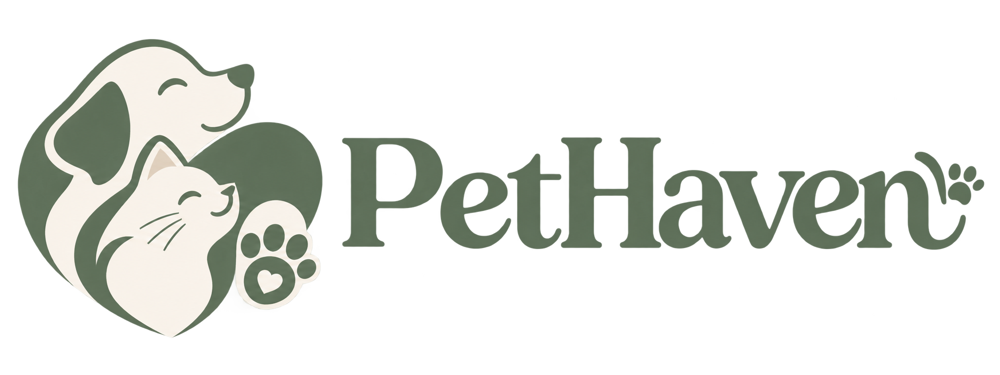
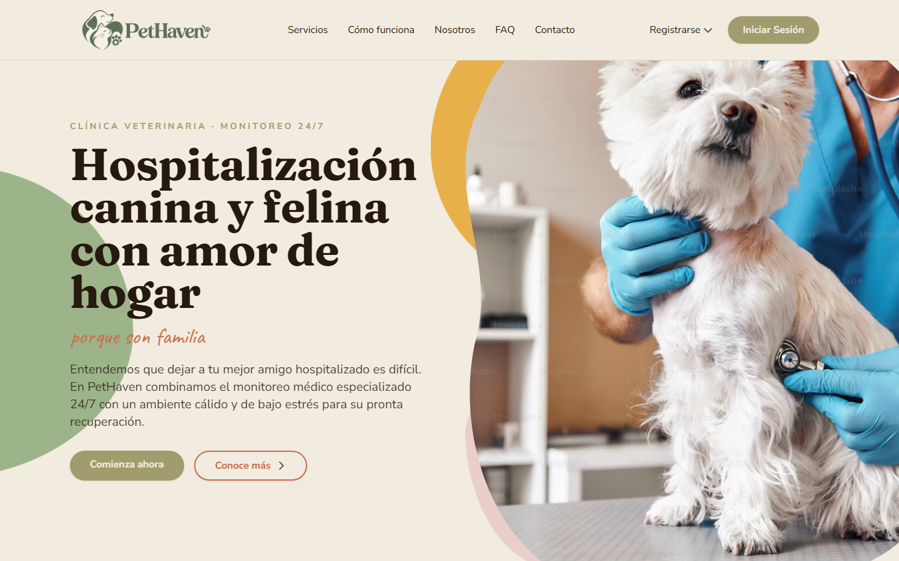
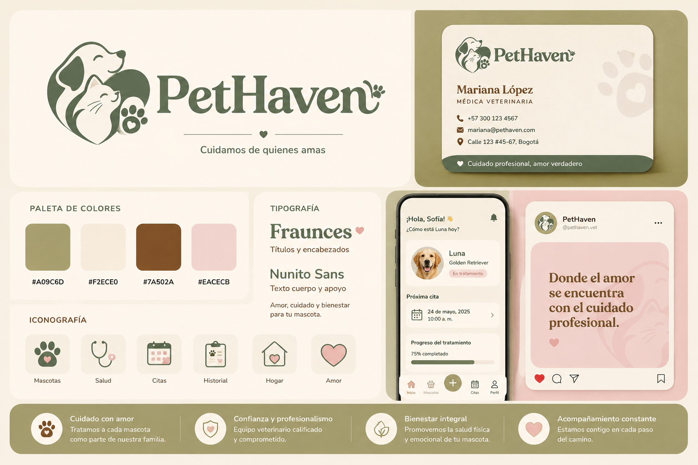
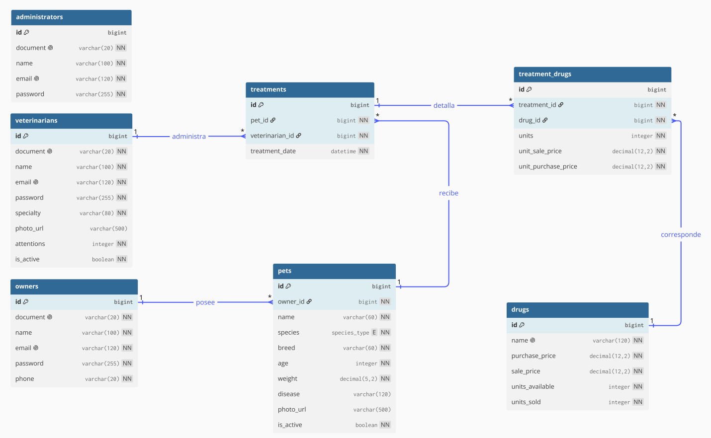

<div align="center">



# PetHaven

**Hospitalización canina y felina con amor de hogar — porque son familia**

[](https://openjdk.org)
[](https://spring.io/projects/spring-boot)
[](https://www.thymeleaf.org)
[](https://www.h2database.com)
[](https://maven.apache.org)
[](LICENSE)



</div>

---

## Sobre PetHaven

PetHaven es una clínica veterinaria especializada en la **hospitalización de perros y gatos** que necesitan reposo y tratamiento dentro de sus instalaciones. Sus pacientes se quedan varios días bajo cuidado constante, mientras los veterinarios administran tratamientos hasta su recuperación.

Hasta ahora, buena parte de la operación vivía en papel y en hojas de Excel: el inventario de drogas, las atenciones médicas y el seguimiento de cada paciente. Este proyecto digitaliza ese negocio con una plataforma web que conecta a **tres tipos de usuario**:

| Rol | Qué puede hacer |
|---|---|
| **Cliente** (dueño) | Iniciar sesión, ver sus mascotas hospitalizadas en formato de tarjeta y consultar el detalle de cada una |
| **Veterinario** | Registrar dueños y mascotas, llevar el historial de atenciones y administrar tratamientos *(en desarrollo)* |
| **Administrador** | Gestionar el equipo de veterinarios y analizar los KPIs del negocio: mascotas en tratamiento, atenciones realizadas, ventas y ganancias *(en desarrollo)* |

**El flujo del negocio:**

1. El dueño llega por primera vez y deja sus datos personales (cédula, nombre, correo, celular).
2. El veterinario registra a la mascota: nombre, raza, edad, peso, enfermedad y foto.
3. La mascota queda hospitalizada mientras recibe tratamientos.
4. Al recuperarse y ser recogida, la mascota pasa a estado **inactivo** — su historial nunca se borra.

---

## Funcionalidades

### Implementadas — Entrega 1 (Features 1 a 7)

- [x] **Feature 01 — Diseño**: nombre, logo, paleta de colores y mockups navegables diferenciados por tipo de usuario
- [x] **Feature 02 — Repositorio**: GitHub público con ramas de `desarrollo` y `main` (producción)
- [x] **Feature 03 — Base de datos**: entidades JPA, repositorios Spring Data y datos de prueba que simulan el funcionamiento real
- [x] **Feature 04 — Landing page**: sitio promocional de la clínica con navegación hacia los portales
- [x] **Feature 05 — Portal cliente**: inicio de sesión y consulta de mascotas en tarjetas con su detalle
- [x] **Feature 06 — CRUD de dueños**: crear, consultar, actualizar y eliminar (con eliminación en cascada de sus mascotas)
- [x] **Feature 07 — CRUD de mascotas**: crear, consultar, actualizar y activar/desactivar

### Roadmap

**Pendientes de la Entrega 1**

| Funcionalidad | Detalle |
|---|---|
| Búsqueda de mascotas | Buscar una mascota por nombre y mostrar su información junto con la de su dueño (AC21) |

**Entrega 2 (Features 8 a 11)**

| Funcionalidad | Detalle |
|---|---|
| Portal de administración | Registrar, actualizar y activar/desactivar veterinarios (Feature 08) |
| Dashboard de KPIs | Mascotas en tratamiento, atenciones, ventas, ganancias y top de tratamientos más vendidos (Feature 09) |
| Carga de medicamentos | Importar el inventario de drogas desde un archivo al iniciar el programa (Feature 09) |
| Tratamientos | Administrar una droga a una mascota y descontar el inventario disponible (Feature 10) |
| Historial médico | Consultar la lista de tratamientos dados a cada mascota (Feature 11) |
| SPA en Angular | Migración del frontend a una aplicación de una sola página |

**Entrega 3**

| Funcionalidad | Detalle |
|---|---|
| Control de acceso por roles | Restringir cada funcionalidad según el rol del usuario (Feature 13) |
| Pruebas del cliente web | Al menos 2 casos de uso automatizados |
| Pruebas de backend | 25 pruebas automatizadas que cargan y limpian sus propios datos de prueba |

---

## Stack tecnológico

| Capa | Tecnología |
|---|---|
| Lenguaje | Java 21 |
| Backend | Spring Boot 4.1 — Web MVC, Data JPA, DevTools |
| Vistas | Thymeleaf + HTML, CSS y JavaScript |
| Base de datos | H2 en modo archivo, con consola de administración web |
| Utilidades | Lombok |
| Build | Maven Wrapper |

---

## Estructura del proyecto

```
pethaven/
├── docs/
│   ├── architecture/              # Diagrama entidad-relación
│   ├── design/                    # Logo e identidad de marca
│   ├── screenshots/               # Capturas para este README
│   └── Enunciado_Veterinaria.pdf  # Definición del negocio y requerimientos
│
├── src/main/java/io/github/pethaven/
│   ├── controller/                # Controladores MVC (rutas web)
│   ├── service/                   # Lógica de negocio
│   ├── repository/                # Repositorios Spring Data JPA
│   ├── entity/                    # Entidades JPA: Owner, Pet, Species
│   ├── exception/                 # Manejo global de errores
│   ├── DataLoader.java            # Datos de prueba cargados al arrancar
│   └── PethavenBackendApplication.java
│
├── src/main/resources/
│   ├── templates/                 # Vistas Thymeleaf (landing, login, CRUDs)
│   ├── static/                    # CSS, JS, imágenes y videos
│   └── application.properties     # Configuración (datasource, JPA, H2)
│
└── pom.xml
```

---

## Primeros pasos

### Requisitos previos

- **JDK 21** o superior
- **Git** (para clonar el repositorio)
- No necesitas Maven instalado: el proyecto incluye el *Maven Wrapper*

### Ejecución

```bash
# 1. Clona el repositorio
git clone https://github.com/JoythDev/pethaven.git
cd pethaven

# 2. Arranca la aplicación
./mvnw spring-boot:run        # en Windows: .\mvnw.cmd spring-boot:run
```

La base de datos H2 se crea y puebla automáticamente con datos de prueba al primer arranque. Abre **<http://localhost:8080>** en tu navegador.

### Credenciales de prueba

Puedes iniciar sesión como cliente con cualquiera de los dueños precargados:

| Correo | Contraseña |
|---|---|
| `john.doe@example.com` | `password123` |

### Consola de H2

La base de datos expone una consola web para explorar tablas y datos:

| Parámetro | Valor |
|---|---|
| URL | `http://localhost:8080/h2` |
| JDBC URL | `jdbc:h2:file:./pethaven-database` |
| Usuario | `sa` |
| Contraseña | *(vacía)* |

---

## Rutas disponibles

| Método | Ruta | Descripción |
|---|---|---|
| `GET` | `/` | Landing page de la clínica |
| `GET` | `/login` | Formulario de acceso del cliente |
| `POST` | `/login` | Autenticación del cliente |
| `GET` | `/pets` | Listado de todas las mascotas |
| `GET` | `/pets/{id}` | Detalle de una mascota |
| `GET` / `POST` | `/pets/add` | Registrar una nueva mascota |
| `GET` / `POST` | `/pets/update/{id}` | Actualizar los datos de una mascota |
| `POST` | `/pets/toggle/{id}` | Activar / desactivar una mascota |
| `GET` | `/owners` | Listado de dueños |
| `GET` | `/owners/{id}` | Detalle de un dueño y sus mascotas |
| `GET` / `POST` | `/owners/add` | Registrar un nuevo dueño |
| `GET` / `POST` | `/owners/update/{id}` | Actualizar los datos de un dueño |
| `GET` | `/owners/delete/{id}` | Eliminar un dueño (y sus mascotas, en cascada) |
| `GET` | `/h2` | Consola de administración de H2 |

---

## Estrategia de ramas

El repositorio sigue el flujo definido en el enunciado del proyecto:

```
main (producción)          ← lo que ve y califica el cliente
 └── desarrollo            ← integración de los cambios del equipo
      └── feature/*        ← una rama por funcionalidad
```

Los cambios se integran primero en `desarrollo`; solo cuando todo está funcional se promueven a `main`.

---

## Documentación

<details>
<summary><b>Identidad de marca</b></summary>
<br/>

</details>

<details>
<summary><b>Diagrama entidad-relación</b></summary>
<br/>

</details>

<details>
<summary><b>Enunciado del proyecto</b></summary>
<br/>
La definición completa del negocio, los requerimientos y las entregas se encuentra en <a href="docs/Enunciado_Veterinaria.pdf">docs/Enunciado_Veterinaria.pdf</a>.
</details>

---

## Equipo

| Integrante      | GitHub                                              |
|-----------------|-----------------------------------------------------|
| Ángel García    | [DeluxeMovie](https://github.com/DeluxeMovie)       |
| Juliana Pacheco | [JuliiPa](https://github.com/JuliiPa)               |
| Manuel Rincon   | [ManuelRincon90](https://github.com/ManuelRincon90) |
| Nicolás Joya    | [JoythDev](https://github.com/JoythDev)             |

---

## Licencia

Este proyecto se distribuye bajo la [Licencia MIT](LICENSE).
